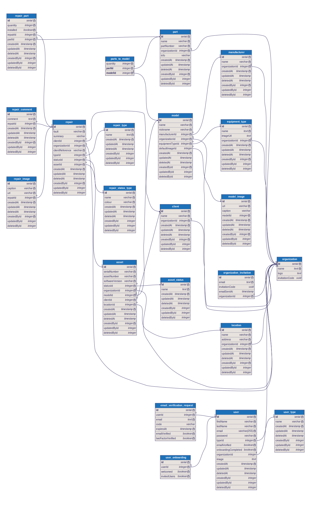

<h3 align="center"><a href="https://workshop-repairs.click/">Workshop Repairs</a></h3>

## About the Project

The goal of the project is to design a fullstack web application for managing and tracking workshop repairs for a biomedical repair company. The initial scope of the project was for tracking repairs and assets within a company across all their clients. This includes the following features:

- **Multi-Tenancy:** Each company can use the application independently, ensuring data separation and security across tenants.
- **Cloud-Native architecture:** Built to scale with demand, ensuring reliability and performance even with growing workloads.
- **Repair and Asset Tracking:** Efficiently track repair workflows and asset lifecycles across multiple clients and locations.
- **Role-Based Access Control (RBAC):** Fine-grained permissions to manage access across users and organizations.
- **Responsive Design:** Fully functional across desktop, tablet, and mobile devices.

### Built With

- [SST](https://sst.dev/)
- [Nextjs](https://nextjs.org/)
- [tRPC](https://trpc.io/)
- [Shadcn](https://ui.shadcn.com/)
- [Tailwind CSS](https://tailwindcss.com/)
- [Drizzle ORM](https://orm.drizzle.team/)

## Cloud Architecture

Cloud architecture is handled by SST, an Infrastructure as Code abstraction built on top of Pulumi and Terraform. Below is the simple diagram of the architecture used for the application:


NextJs Server architecture can be viewed in detail [here](https://opennext.js.org/aws/inner_workings/architecture)

## App Architecture

The app is built using a monorepo approach, which separates logic into distinct areas of abstraction to maintain modularity and scalability. Each layer of the app has a well-defined role:

### Frontend:

- **Framework:** Built on Next.js App Router to handle both client-side and server-side rendering (SSR).
- **UI:** Designed with Shadcn components and styled using Tailwind CSS for a responsive and visually appealing interface.
- **Tables:** Implements TanStack Table for a headless table UI, featuring server-side pagination, sorting, and filtering to handle large datasets efficiently.

### API:

- **Framework:** Built with tRPC for type-safe API calls between the frontend and backend, ensuring strong typing between frontend and backend.
- **Data Management:** Utilizes React Query for caching, synchronization, and efficient state management of API data.
- **User Validation:** Zod schemas are used to validate user input and ensure invalid data is not propagated through the application.

### Authentication:

- **Implementation:** Custom authentication using JSON Web Tokens (JWT).
- **Security:** Tokens are securely stored in HTTP-only cookies, enabling both server-side and client-side authentication.

### Database

- **ORM:** Drizzle ORM for a typesafe abstraction over SQL.
- **Design Pattern:** Data access is abstracted using a repository layer, so that database implementation details are not leaked to the API layer.

## Database Architecture



## Getting Started

To get started with the project, follow the steps below to set up your development environment by creating a local staging environment.

### Prerequisites

1. [Download Docker](https://www.docker.com/)
2. [Set up AWS Account](https://aws.amazon.com/)
3. [AWS CLI](https://docs.aws.amazon.com/cli/latest/userguide/cli-chap-getting-started.html)
4. [Follow these steps to set up AWS CLI](https://guide.sst.dev/chapters/configure-the-aws-cli.html)

### Installation

1. Clone the repository

```bash
git clone https://github.com/Michaelp1994/workshop-repairs.git
```

2. Install dependencies

```bash
pnpm install
```

3. Run the development script.

```bash
pnpm run dev
```

Any problems? Please open an issue on the [Github Issues](https://github.com/Michaelp1994/workshop-repairs/issues) page.

### Deployment

When you are ready to deploy the application to production, use the following command:

```bash
pnpm sst deploy --stage production
```

This will deploy your application to AWS and configure the associated architecture (RDS Database, S3 Buckets, CDN and Lambda Functions).

### Future Plans

Here are some features and enhancements planned for future releases:

- Servicing and Job Tracking: Add support for keeping track of annual servicing of equipment.
- Localization Support: Add internationalization.
- Audit Logs: Track user actions and system changes for improved accountability.
- Inventory System: keep track of part inventory and automate/ease resupply.
- Client Portal: Ability to invite clients to view a subset of records such as asset records for their equipment.

## Contributing

If you would like to contribute to the project, there are many ways in which you can help:

If you're experiencing a bug or have a suggestion for how to improve, please open a [new issue](https://github.com/Michaelp1994/workshop-repairs/issues).

If you're interested in contributing code, please submit a [pull request](https://github.com/Michaelp1994/workshop-repairs/pulls).

## Contact

- [LinkedIn](https://www.linkedin.com/in/michael-poulgrain/)
- [Email](mailto:michael.poulgrain@gmail.com)
